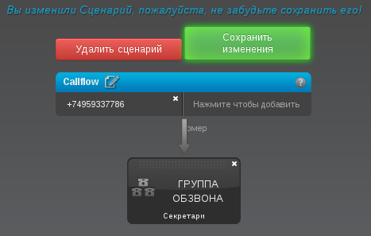
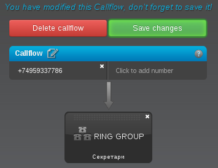
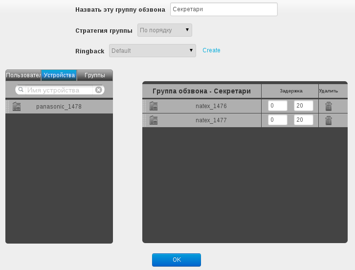
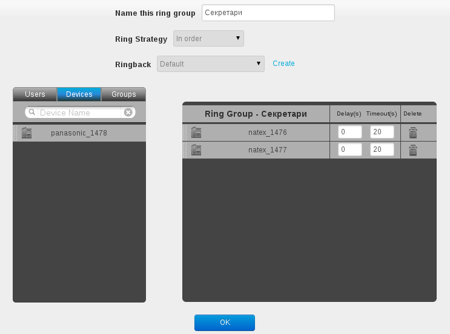

Алгоритмы распределенения звонков
=================================

В настоящее время доступны два алгоритма распределения звонков:

1) звонок одновременно подается на все телефоны в группе распределения звонков;
2) звонок поочередно подается на телефоны в группе распределения звонков;

Для настройки распределения звонков необходимо выбрать в меню "Виртуальная АТС" (Hosted PBX) -> "Сценарии" (Callflows). Далее необходимо
в списке слева выбрать номер при поступлении звонка на который будем распределеть звонки.
В случае если такого номера нет, то его необходимо создать нажав кнопку "ДОБАВИТЬ СЦЕАНАРИЙ" (ADD CALLFLOW).

В открывшемся окне необходимо добавить (проверить) номер телефона при звонке на который будет применятся
заданная схема обработки звонка. Для этого необходимо выбрать в меню "Действия", в правой части экрана, функциональный блок
"Группа обзвона" (Ring Group) и перетащить его на элемент "Callflow" в середине экрана. Если вы создаете новый сценарий, то
у вас откроется окно настройки параметров группы обзвона. Если вы редактируется существующий сценарий, то необходимо окрыть настройки
парметров двойным щелчком по блоку "ГРУППА ОБЗВОНА" (Ring Group).

Внешний вид настроенного сценария распределения звонков показан на рисунках ниже.

   Внешний вид настроенного сценария распределения звонков (русский язык).

   Внешний вид настроенного сценария распределения звонков (английский язык).

Для настройки параметров распределения звонков Вы будете пользоваться формой показаной на рисунке ниже.

   Внешний вид формы настройки параметров сценария распределения звонков (русский язык).

   Внешний вид формы настройки параметров сценария распределения звонков (английский язык).

Форма содержит следущие поля:

1) "Назвать эту группу обзвона" - название группы распределения звонков;
2) "Стратегия группы" - схема распределения звонков;
3) "Ringback" - мелодия которую будет слушать звонящий пока ожидает ответа;
4) "Группа обзвона" в нижней правой части формы - перечень телефонных аппаратов, пользователей или групп на которую распределяются звонки;
5) "Пользоатели / Устройства / Группы" в нижней левой части формы - перечень телфонных аппаратов, пользователей
   и групп доступных для включения в группу обзвона.

Схема распределения звонков может быть "одновременно" и "по порядку". Порядок обзвона определяется положением устройсва (пользователя или группы)
в списке в нижней правой части формы. Самый чем выше в списке, тем раньше поступит звонок. Время сколько звонок будет ждать ответа
устройсва (пользователя или группы) в списке задается во втором поле колонки "Задержка". В первом поле этой колонки задано время задержки звонка.
В примере показаном на рисунке звонок сперва раздается на телефонном аппарате "natex_1476" в течении 20 секунт, после чего переходит на телефнный
апарат "natex_1477" и на нем раздается также в течении 20 секунд.
Для изменения порядка обхода звонка необходимо элемент списка перащить с помощью указателя мышь выше или ниже в списке.
Для добавления устройства (пользователя или группы) в список, необходимо его перетащить из нижней левой части формы.

Также в форме вы можете задать отличную от стандартной мелодию которую будет слушать звонящий пока ожидает ответа. Мелодия предварительно должна
быть загружена через меню "Виртуальная АТС" -> "Расширенные" -> "Медиа-файлы".

