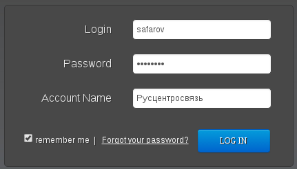

Вход в личный кабинет
=====================

Личный кабинет пользователя размещен по адресам:

1) http://self.rcsnet.ru/ru - русская версия личного кабинета;
2) http://self.rcsnet.ru - английская версия личного кабинета.

Далее по тексту будет приводиться ссылки на русские наименования элементов управления и в скобках английские.
После того как вы перешли в браузере на страницу личного кабинета вам откроется форма с полями для ввода:

1) Логина / Почты (Login);
2) Пароля (Password)
3) Наименования клиента (Account Name).

Внешний вид формы представлен на рисунках ниже

   Форма ввода данных личного кабинета для русскоязычных клиентов.

   Форма ввода данных личного кабинета для англоязычных клиентов.

Вам следует заполнить форму данными которые были получены от менеджеров компании Русцентросвязь и нажать клавишу "Войти" (Login).
Для того чтобы поле "Клиент" (Account Name) было запомнено браузером следует установить галочку "Запомнить" (remember me).

Дальнейший вид личного кабинета зависит от заказанных вами функций виртуальной АТС в максимальной конфигурации будет выглядеть
как показано на рисунке ниже.

   Внешний вид меню с максимальным количеством опций.

Для добавления или удаления элементов рабочего стола следует навести указатель мыши на название вашего логина и открыть в меню
пункт "Приложения". В результате откроется форма в которой вы сможете добавить или удалить элементы управления виртуальной АТС.
Пример внешнего вида формы показан на рисунках ниже.

   Форма выбора опций виртуальной АТС отображаемых в рабочем поле (русский язык).

   Форма выбора опций виртуальной АТС отображаемых в рабочем поле (английский язык).
